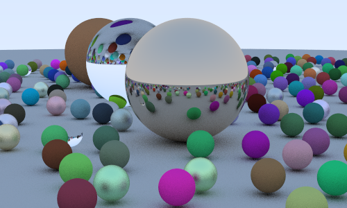
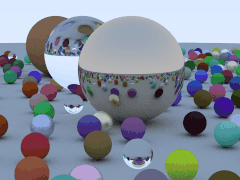

# go-raytrace

I follow the book *Ray Tracing in One Weekend* and implement the code in golang
The feature in chapter 11 Defocus Blur, I didn't implement

The speed of render is very slow

## Ref
1. [Book: Ray Tracing in One Weekend](http://www.realtimerendering.com/raytracing/Ray%20Tracing%20in%20a%20Weekend.pdf)
2. [Code: Ray Tracing in One Weekend](https://github.com/erich666/RealTimeRendering)
3. [another guy implement code in go](https://github.com/markphelps/go-trace)